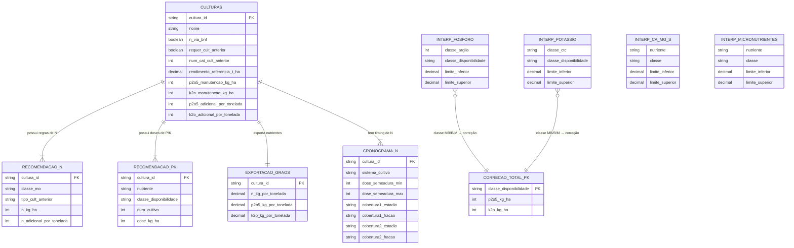

# DOCUMENTO DE REQUISITOS E ARQUITETURA
## Módulo de Adubação — Culturas de Grãos
### Base: Manual de Calagem e Adubação ROLAS-RS/SC (2016) — Cap. 6 / Seção 6.1
**Versão:** 2.0 | **Culturas cobertas:** 16 culturas de grãos

> **NOTA ARQUITETURAL:** Este módulo opera de forma **totalmente independente** do módulo de calagem existente. Consome apenas os *valores numéricos brutos* da análise de solo. Deve emitir um **alerta passivo** quando pH indicar necessidade de calagem, pois isso afeta a eficiência dos fertilizantes — mas sem recalcular calagem.
>
> **SIMPLIFICAÇÃO ESTRUTURAL:** Todas as 16 culturas deste módulo pertencem ao **Grupo P2** (interpretação de fósforo igual às culturas de grãos) e ao **Grupo K2** (interpretação de potássio igual às culturas de grãos). Isso significa que existe **apenas uma tabela de interpretação de P** (por classe de argila) e **apenas uma tabela de interpretação de K** (por classe de CTC) para todo o módulo — eliminando a necessidade de lógica de roteamento por grupo de cultura.

---

## SUMÁRIO

1. [Entradas de Dados (Inputs)](#1-entradas-de-dados)
2. [Regras de Visibilidade — Frontend React](#2-regras-de-visibilidade-frontend-react)
3. [Mapeamento de Tabelas de Referência](#3-mapeamento-de-tabelas-de-referência)
4. [Lógica de Cálculo (Business Logic)](#4-lógica-de-cálculo-business-logic)
5. [Saídas do Sistema (Outputs)](#5-saídas-do-sistema-outputs)
6. [Edge Cases e Problemas Potenciais](#6-edge-cases-e-problemas-potenciais)
7. [Apêndice — Diagrama de Entidade-Relacionamento](#7-apêndice--diagrama-de-entidade-relacionamento)

---

## 1. ENTRADAS DE DADOS

Os inputs estão divididos em dois grupos. A seção 2 detalha com precisão **quais campos aparecem, quando e com quais opções** para o frontend React.

---

### 1.1 GRUPO A — Análise de Solo

| ID | Campo | Unidade | Tipo | Visibilidade | Valores / Validação |
|----|-------|---------|------|:------------:|---------------------|
| A01 | Teor de Argila | % | Decimal | **Sempre** | `0 ≤ valor ≤ 99` |
| A02 | Matéria Orgânica (MO) | % | Decimal | **Sempre** | `0 < valor ≤ 20` |
| A03 | CTC pH 7,0 | cmolc/dm³ | Decimal | **Sempre** | `valor > 0` |
| A04 | Fósforo disponível (P) | mg/dm³ | Decimal | **Sempre** | `valor > 0` |
| A05 | Método de extração do P | — | **Enum** | **Sempre** | `['Mehlich-1', 'Mehlich-3']` |
| A06 | Potássio disponível (K) | mg/dm³ | Decimal | **Sempre** | `valor > 0` |
| A07 | Método de extração do K | — | **Enum** | **Sempre** | `['Mehlich-1', 'Mehlich-3']` |
| A08 | Cálcio trocável (Ca) | cmolc/dm³ | Decimal | **Sempre** | `valor > 0` |
| A09 | Magnésio trocável (Mg) | cmolc/dm³ | Decimal | **Sempre** | `valor > 0` |
| A10 | Enxofre extraível (S) | mg/dm³ | Decimal | **Condicional** ¹ | `valor > 0` |
| A11 | Cobre (Cu) | mg/dm³ | Decimal | **Opcional** ² | `valor ≥ 0` |
| A12 | Zinco (Zn) | mg/dm³ | Decimal | **Opcional** ² | `valor ≥ 0` |
| A13 | Boro (B) | mg/dm³ | Decimal | **Opcional** ² | `valor ≥ 0` |
| A14 | Manganês (Mn) | mg/dm³ | Decimal | **Opcional** ² | `valor ≥ 0` |

**¹ A10 (Enxofre):** Condição de exibição detalhada na Seção 2.
**² A11–A14 (Micronutrientes):** Sempre presentes no formulário, mas agrupados em uma seção expansível/colapsável. Nenhum é obrigatório. Se informados, o sistema emite diagnose de disponibilidade e alertas.

---

### 1.2 GRUPO B — Dados da Cultura e Manejo

| ID | Campo | Tipo | Visibilidade | Valores Possíveis (Enum) / Validação |
|----|-------|------|:------------:|--------------------------------------|
| B01 | Cultura | **Enum** | **Sempre** | Ver lista abaixo ↓ |
| B02 | Número do cultivo desde a análise | **Enum** | **Sempre** | `['1', '2']` |
| B03 | Expectativa de rendimento | Decimal (t/ha) | **Sempre** | `valor > 0` — validar faixa realista por cultura (ver Seção 6.2) |
| B04 | Cultura antecedente | **Enum** | **Condicional** ³ | Depende da cultura selecionada — ver Seção 2 |
| B05 | Sistema de cultivo | **Enum** | **Sempre** | `['Convencional', 'Plantio Direto']` |
| B06 | Tipo de adubação corretiva | **Enum** | **Condicional** ⁴ | `['Gradual', 'Total']` — `'Total'` desabilitado se argila < 20% ou CTC < 7,5 |
| B07 | Densidade de plantas | Integer (plantas/ha) | **Condicional** ⁵ | `valor > 0` — somente para milho |

**³ B04:** Condição e opções detalhadas na Seção 2.
**⁴ B06:** Campo sempre visível após a entrada dos dados de solo; a opção `'Total'` fica **desabilitada** (disabled) se `argila < 20%` OR `CTC < 7,5`. Condição completa na Seção 2.
**⁵ B07:** Visível apenas quando `cultura = 'milho'`. Opcional. Se preenchido e `> 65.000`, o sistema aplica ajuste adicional de N.

---

#### Lista Completa de Culturas — Enum de B01

| Valor (enum) | Label exibido | N via BNF | Requer B04 | Opções de B04 |
|---|---|:---:|:---:|---|
| `aveia_branca` | Aveia Branca | ❌ | ✅ | `['Leguminosa', 'Gramínea']` |
| `aveia_preta` | Aveia Preta | ❌ | ✅ | `['Leguminosa', 'Gramínea']` |
| `canola` | Canola | ❌ | ❌ | — |
| `centeio` | Centeio | ❌ | ✅ | `['Leguminosa', 'Gramínea']` |
| `cevada` | Cevada | ❌ | ✅ | `['Leguminosa', 'Gramínea']` |
| `ervilha` | Ervilha Seca e Forrageira | ✅ | ❌ | — |
| `ervilhaca` | Ervilhaca | ✅ | ❌ | — |
| `feijao` | Feijão | ⚠️ Parcial* | ❌ | — |
| `girassol` | Girassol | ❌ | ❌ | — |
| `milho` | Milho | ❌ | ✅ | `['Leguminosa', 'Consorciação ou Pousio', 'Gramínea']` |
| `milho_pipoca` | Milho Pipoca | ❌ | ❌ | — |
| `nabo_forrageiro` | Nabo Forrageiro | ❌ | ❌ | — |
| `soja` | Soja | ✅ | ❌ | — |
| `sorgo` | Sorgo | ❌ | ❌ | — |
| `trigo` | Trigo | ❌ | ✅ | `['Leguminosa', 'Gramínea']` |
| `triticale` | Triticale | ❌ | ✅ | `['Leguminosa', 'Gramínea']` |

*Feijão: inoculação sempre recomendada; dose de N calculada mas com instrução de avaliação de nodulação.

---

## 2. REGRAS DE VISIBILIDADE — FRONTEND REACT

Esta seção define de forma **precisa e diretamente utilizável** quando cada campo condicional ou opcional deve ser exibido, ocultado ou desabilitado no formulário React.

---

### 2.1 Campos do Grupo A

#### A10 — Enxofre (S)

```
MOSTRAR quando:
  formValues.cultura ∈ ['soja', 'ervilha', 'ervilhaca', 'canola', 'nabo_forrageiro']

React:
  visible={['soja', 'ervilha', 'ervilhaca', 'canola', 'nabo_forrageiro']
    .includes(formValues.cultura)}

OBRIGATÓRIO quando visível: SIM
LABEL sugerido: "Enxofre extraível (S) — mg/dm³"
TOOLTIP: "Obrigatório para leguminosas, brássicas e liliáceas. 
          Extrator: sulfato de cálcio (500 mg/L), camada 0-20 cm."
```

#### A11 a A14 — Micronutrientes (Cu, Zn, B, Mn)

```
MOSTRAR: SEMPRE (seção colapsável, fechada por padrão)
OBRIGATÓRIO: NÃO (nenhum dos quatro)
COMPORTAMENTO: Exibir como accordion/collapsible "Micronutrientes (opcional)"
QUANDO INFORMADOS: sistema inclui diagnose de disponibilidade no output
```

---

### 2.2 Campos do Grupo B

#### B04 — Cultura Antecedente

```
REGRA DE VISIBILIDADE:
  MOSTRAR quando formValues.cultura ∈ [
    'aveia_branca', 'aveia_preta', 'centeio', 'cevada',
    'trigo', 'triticale', 'milho'
  ]
  OCULTAR para todas as outras culturas.

React (visibilidade):
  visible={[
    'aveia_branca', 'aveia_preta', 'centeio', 'cevada',
    'trigo', 'triticale', 'milho'
  ].includes(formValues.cultura)}

REGRA DE OPÇÕES (as opções do Select mudam conforme a cultura):

  SE formValues.cultura === 'milho':
    options = [
      { value: 'leguminosa',           label: 'Leguminosa' },
      { value: 'consorciacao_pousio',  label: 'Consorciação ou Pousio' },
      { value: 'graminea',             label: 'Gramínea' }
    ]

  SENÃO (aveia, centeio, cevada, trigo, triticale):
    options = [
      { value: 'leguminosa', label: 'Leguminosa' },
      { value: 'graminea',   label: 'Gramínea' }
    ]

OBRIGATÓRIO quando visível: SIM
TOOLTIP específico para milho: "Se a cultura anterior foi nabo forrageiro, 
  selecione 'Leguminosa'. O sistema aplicará a regra de produção 
  média/baixa conforme o teor de MO do solo."
```

#### B06 — Tipo de Adubação Corretiva

```
REGRA DE VISIBILIDADE:
  MOSTRAR SEMPRE após o preenchimento do Grupo A.
  (Campo presente no formulário desde o início, mas só relevante
  quando o solo tem P ou K abaixo do teor crítico.)

REGRA DE ESTADO DA OPÇÃO 'Total':
  DESABILITADA (disabled) quando:
    formValues.argila < 20 OR formValues.ctc < 7.5

  HABILITADA quando:
    formValues.argila >= 20 AND formValues.ctc >= 7.5

React (disable da opção Total):
  const totalCorrectionAllowed =
    parseFloat(formValues.argila) >= 20 &&
    parseFloat(formValues.ctc) >= 7.5

  <Select>
    <Option value="gradual">Gradual (padrão)</Option>
    <Option value="total" disabled={!totalCorrectionAllowed}>
      Total {!totalCorrectionAllowed
        ? '— indisponível (argila < 20% ou CTC < 7,5)'
        : ''}
    </Option>
  </Select>

DEFAULT: 'gradual'
OBRIGATÓRIO: SIM (mas já tem default)
TOOLTIP: "Correção Total: aplica toda a dose corretiva em um único cultivo.
          Requer argila ≥ 20% e CTC ≥ 7,5 cmolc/dm³ para evitar 
          risco de lixiviação ou salinidade."
```

#### B07 — Densidade de Plantas

```
REGRA DE VISIBILIDADE:
  MOSTRAR APENAS quando formValues.cultura === 'milho'

React:
  visible={formValues.cultura === 'milho'}

OBRIGATÓRIO quando visível: NÃO (opcional)
DEFAULT: vazio (sem preenchimento = sem ajuste de densidade)
VALIDAÇÃO: valor inteiro, entre 30.000 e 120.000 plantas/ha
PLACEHOLDER: "Ex.: 65000"
TOOLTIP: "Se densidade > 65.000 plantas/ha, o sistema acrescenta 
          10 kg N/ha para cada 5.000 plantas adicionais."
```

---

### 2.3 Resumo Visual das Regras — Tabela de Referência Rápida

| Campo | Visível Por Padrão | Condição para Mostrar | Obrigatório Quando Visível |
|-------|:------------------:|------------------------|:--------------------------:|
| A01 – Argila | ✅ | Sempre | ✅ |
| A02 – MO | ✅ | Sempre | ✅ |
| A03 – CTC | ✅ | Sempre | ✅ |
| A04 – P | ✅ | Sempre | ✅ |
| A05 – Método P | ✅ | Sempre | ✅ |
| A06 – K | ✅ | Sempre | ✅ |
| A07 – Método K | ✅ | Sempre | ✅ |
| A08 – Ca | ✅ | Sempre | ✅ |
| A09 – Mg | ✅ | Sempre | ✅ |
| A10 – S | ❌ | `cultura ∈ ['soja','ervilha','ervilhaca','canola','nabo_forrageiro']` | ✅ |
| A11 – Cu | ✅ (colapsado) | Sempre (accordion) | ❌ |
| A12 – Zn | ✅ (colapsado) | Sempre (accordion) | ❌ |
| A13 – B | ✅ (colapsado) | Sempre (accordion) | ❌ |
| A14 – Mn | ✅ (colapsado) | Sempre (accordion) | ❌ |
| B01 – Cultura | ✅ | Sempre | ✅ |
| B02 – Nº Cultivo | ✅ | Sempre | ✅ |
| B03 – Rendimento | ✅ | Sempre | ✅ |
| B04 – Cultura Ant. | ❌ | `cultura ∈ ['aveia_branca','aveia_preta','centeio','cevada','trigo','triticale','milho']` | ✅ |
| B05 – Sistema Cultivo | ✅ | Sempre | ✅ |
| B06 – Tipo Correção | ✅ | Sempre (opção 'Total' disabled condicionalmente) | ✅ |
| B07 – Densidade Plantas | ❌ | `cultura === 'milho'` | ❌ |

---

## 3. MAPEAMENTO DE TABELAS DE REFERÊNCIA

> **Nota:** Como todas as 16 culturas do módulo pertencem ao **Grupo P2** e ao **Grupo K2**, o sistema usa exatamente **uma tabela de interpretação de P** (TAB-02P) e **uma tabela de interpretação de K** (TAB-02K). Não há roteamento por grupo de cultura nesta versão do módulo.

---

### 3.1 TABELAS DE CLASSIFICAÇÃO DO SOLO

#### TAB-01A — Classificação de Argila
*(Fonte: Tabela 6.1 do Manual)*

| Faixa de Argila (%) | Classe |
|---------------------|:------:|
| ≤ 20 | 4 |
| 21 – 40 | 3 |
| 41 – 60 | 2 |
| > 60 | 1 |

#### TAB-01B — Classificação de Matéria Orgânica
*(Fonte: Tabela 6.1 do Manual)*

| Faixa de MO (%) | Classe |
|-----------------|--------|
| ≤ 2,5 | `baixo` |
| 2,6 – 5,0 | `medio` |
| > 5,0 | `alto` |

#### TAB-01C — Classificação de CTCpH7,0
*(Fonte: Tabela 6.1 do Manual)*

| Faixa de CTC (cmolc/dm³) | Classe |
|--------------------------|--------|
| ≤ 7,5 | `baixa` |
| 7,6 – 15,0 | `media` |
| 15,1 – 30,0 | `alta` |
| > 30,0 | `muito_alta` |

---

### 3.2 TABELAS DE INTERPRETAÇÃO DE P E K

#### TAB-02P — Interpretação do Teor de Fósforo (Grupo 2 — todas as culturas do módulo)
*(Fonte: Tabela 6.4 do Manual)*
*Valores em mg de P/dm³*

| Classe de Disponibilidade | Argila Classe 1 (>60%) | Argila Classe 2 (41–60%) | Argila Classe 3 (21–40%) | Argila Classe 4 (≤20%) |
|:-------------------------:|:----------------------:|:------------------------:|:------------------------:|:----------------------:|
| `muito_baixo` | ≤ 3,0 | ≤ 4,0 | ≤ 6,0 | ≤ 10,0 |
| `baixo` | 3,1 – 6,0 | 4,1 – 8,0 | 6,1 – 12,0 | 10,1 – 20,0 |
| `medio` | 6,1 – 9,0 | 8,1 – 12,0 | 12,1 – 18,0 | 20,1 – 30,0 |
| `alto` | 9,1 – 18,0 | 12,1 – 24,0 | 18,1 – 36,0 | 30,1 – 60,0 |
| `muito_alto` | > 18,0 | > 24,0 | > 36,0 | > 60,0 |

> **Conversão Mehlich-3 para P:** Se `método = 'Mehlich-3'`:
> `P_M1 = P_M3 / (2 - (0,02 × argila_%))`
> Usar `P_M1` para consulta nesta tabela.

#### TAB-02K — Interpretação do Teor de Potássio (Grupo 2 — todas as culturas do módulo)
*(Fonte: Tabela 6.9 do Manual)*
*Valores em mg de K/dm³*

| Classe de Disponibilidade | CTC ≤ 7,5 | CTC 7,6–15,0 | CTC 15,1–30,0 | CTC > 30,0 |
|:-------------------------:|:---------:|:------------:|:-------------:|:----------:|
| `muito_baixo` | ≤ 20 | ≤ 30 | ≤ 40 | ≤ 45 |
| `baixo` | 21 – 40 | 31 – 60 | 41 – 80 | 46 – 90 |
| `medio` | 41 – 60 | 61 – 90 | 81 – 120 | 91 – 135 |
| `alto` | 61 – 120 | 91 – 180 | 121 – 240 | 136 – 270 |
| `muito_alto` | > 120 | > 180 | > 240 | > 270 |

> **Conversão Mehlich-3 para K:** Se `método = 'Mehlich-3'`:
> `K_M1 = K_M3 × 0,83`
> Usar `K_M1` para consulta nesta tabela.

---

### 3.3 TABELAS DE DIAGNOSE DE Ca, Mg, S E MICRONUTRIENTES

#### TAB-03A — Interpretação de Ca, Mg e S
*(Fonte: Tabela 6.11 do Manual)*

| Classe | Ca (cmolc/dm³) | Mg (cmolc/dm³) | S Padrão (mg/dm³) | S Culturas Exigentes¹ (mg/dm³) |
|--------|:--------------:|:--------------:|:-----------------:|:------------------------------:|
| `baixo` | < 2,0 | < 0,5 | < 2,0 | < 2,0 |
| `medio` | 2,0 – 4,0 | 0,5 – 1,0 | 2,0 – 5,0 | 2,0 – 10,0 |
| `alto` | > 4,0 | > 1,0 | > 5,0 | > 10,0 |

¹ Culturas exigentes em S neste módulo: `['soja', 'ervilha', 'ervilhaca', 'canola', 'nabo_forrageiro']`.
Teor crítico de S para essas culturas = **10 mg/dm³** (vs. 5 para as demais).

#### TAB-03B — Interpretação de Micronutrientes no Solo
*(Fonte: Tabela 6.12 do Manual)*

| Classe | Cu (mg/dm³) | Zn (mg/dm³) | B (mg/dm³) | Mn (mg/dm³) |
|--------|:-----------:|:-----------:|:----------:|:-----------:|
| `baixo` | < 0,2 | < 0,2 | ≤ 0,1 | < 2,5 |
| `medio` | 0,2 – 0,4 | 0,2 – 0,5 | 0,2 – 0,3 | 2,5 – 5,0 |
| `alto` | > 0,4 | > 0,5 | > 0,3 | > 5,0 |

---

### 3.4 TABELAS DE RECOMENDAÇÃO GERAL

#### TAB-04 — Correção Total de P e K
*(Fonte: Tabela 6.1.1 do Manual)*
*Usado apenas quando `B06 = 'total'`*

| Classe de P ou K | P₂O₅ para Correção Total (kg/ha) | K₂O para Correção Total (kg/ha) |
|:----------------:|:--------------------------------:|:--------------------------------:|
| `muito_baixo` | 160 | 120 |
| `baixo` | 80 | 60 |
| `medio` | 40 | 30 |

#### TAB-05 — Rendimento de Referência e Manutenção por Cultura
*(Fonte: Tabela 6.1.2 do Manual)*

| Cultura | Rend. Ref. (t/ha) | P₂O₅ Manutenção (kg/ha) | K₂O Manutenção (kg/ha) | P₂O₅ Adic./t extra (kg) | K₂O Adic./t extra (kg) |
|---------|:-----------------:|:------------------------:|:------------------------:|:------------------------:|:------------------------:|
| Aveia Branca | 3 | 45 | 30 | 15 | 10 |
| Aveia Preta | 3 | 45 | 30 | 15 | 10 |
| Canola | 1,5 | 30 | 25 | 20 | 15 |
| Centeio | 2 | 30 | 20 | 15 | 10 |
| Cevada | 3 | 45 | 30 | 15 | 10 |
| Ervilha Seca/Forrageira | 2 | 30 | 40 | 15 | 20 |
| Ervilhaca | 2 | 40 | 50 | 20 | 25 |
| Feijão | 2 | 30 | 40 | 15 | 20 |
| Girassol | 2 | 30 | 30 | 15 | 15 |
| Milho | 6 | 90 | 60 | 15 | 10 |
| Milho Pipoca | 5 | 75 | 50 | 15 | 10 |
| Nabo Forrageiro | 3 | 45 | 60 | 15 | 20 |
| Soja | 3 | 45 | 75 | 15 | 25 |
| Sorgo | 4 | 60 | 40 | 15 | 10 |
| Trigo | 3 | 45 | 30 | 15 | 10 |
| Triticale | 3 | 45 | 30 | 15 | 10 |

#### TAB-06 — Exportação de Nutrientes pelos Grãos (Reposição)
*(Fonte: Tabela 6.1.3 do Manual)*
*Usado para calcular adubação de Reposição (nível `muito_alto`)*

| Cultura | N (kg/t) | P₂O₅ (kg/t) | K₂O (kg/t) |
|---------|:--------:|:-----------:|:----------:|
| Aveia Branca | 20 | 7 | 5 |
| Aveia Preta | 20 | 7 | 5 |
| Canola | 20 | 15 | 12 |
| Centeio | 20 | 9 | 5 |
| Cevada | 20 | 10 | 6 |
| Ervilha Seca/Forrageira | 36 | 9 | 12 |
| Ervilhaca | 35 | 15 | 19 |
| Feijão | 50 | 10 | 15 |
| Girassol | 25 | 14 | 6 |
| Milho | 16 | 8 | 6 |
| Milho Pipoca | 17 | 8 | 6 |
| Nabo Forrageiro | 20 | 11 | 18 |
| Soja | 60 | 14 | 20 |
| Sorgo | 15 | 8 | 4 |
| Trigo | 22 | 10 | 6 |
| Triticale | 22 | 8 | 6 |

---

### 3.5 TABELAS INDIVIDUAIS POR CULTURA — N (Nitrogênio)

**Estrutura no banco:** `(cultura_id, classe_mo, tipo_cult_anterior) → n_kg_ha`

#### TAB-07N — Valores de N base por Cultura

**Culturas com N = 0 (BNF):**

| Cultura | Regra |
|---------|-------|
| Soja | N = 0. Emitir instrução de inoculação com rizóbio. |
| Ervilha | N = 0. Emitir instrução de inoculação com rizóbio. |
| Ervilhaca | N = 0. Emitir instrução de inoculação com rizóbio. |

**Culturas com N por MO × Cultura Anterior (2 categorias):**

| Cultura | MO Baixo / Leg | MO Médio / Leg | MO Alto / Leg | MO Baixo / Gram | MO Médio / Gram | MO Alto / Gram | N Adic. acima ref. |
|---------|:-:|:-:|:-:|:-:|:-:|:-:|---|
| Aveia Branca | 60 | 40 | ≤20 | 80 | 60 | ≤20 | +20 (leg) / +30 (gram) kg/t acima 3 t |
| Aveia Preta | 60 | 40 | ≤20 | 80 | 60 | ≤20 | +20 (leg) / +30 (gram) kg/t acima 3 t |
| Centeio | 40 | 20 | ≤10 | 50 | 30 | ≤10 | +20 (leg) / +30 (gram) kg/t acima 2 t |
| Cevada | 60 | 40 | ≤20 | 80 | 60 | ≤20 | +20 (leg) / +30 (gram) kg/t acima 3 t |
| Trigo | 60 | 40 | ≤20 | 80 | 60 | ≤20 | +20 (leg) / +30 (gram) kg/t acima 3 t |
| Triticale | 60 | 40 | ≤20 | 80 | 60 | ≤20 | +20 (leg) / +30 (gram) kg/t acima 3 t |

**Milho — N por MO × Cultura Anterior (3 categorias):**

| MO | Leguminosa | Consorciação ou Pousio | Gramínea | N Adic. acima ref. |
|:--:|:----------:|:----------------------:|:--------:|---|
| Baixo (≤2,5%) | 70 | 80 | 90 | +15 kg N/t acima 6 t/ha |
| Médio (2,6–5%) | 50 | 60 | 70 | +15 kg N/t acima 6 t/ha |
| Alto (>5%) | ≤40 | ≤40 | ≤50 | +15 kg N/t acima 6 t/ha |

**Culturas com N por MO apenas:**

| Cultura | MO Baixo | MO Médio | MO Alto | N Adic. acima rendimento ref. |
|---------|:--------:|:--------:|:-------:|-------------------------------|
| Canola | 60 | 40 | ≤30 | +20 kg/t acima 1,5 t |
| Feijão* | 70 | 50 | ≤30 | +20 kg/t acima 2 t |
| Girassol | 60 | 40 | ≤30 | +20 kg/t acima 2 t |
| Milho Pipoca | 60 | 40 | ≤30 | +15 kg/t acima 5 t |
| Nabo Forrageiro | 60 | 50 | ≤20 | +20 kg/t acima 3 t |
| Sorgo | 75 | 55 | ≤20 | +15 kg/t acima 4 t |

*Feijão: inocular com rizóbio. Avaliar nodulação aos 15-20 dias. Se adequada (>20 nódulos/planta, cor avermelhada): N em cobertura pode ser suprimido.

---

### 3.6 TABELAS INDIVIDUAIS POR CULTURA — P₂O₅ E K₂O

**Estrutura no banco:** `(cultura_id, nutriente, classe_disponibilidade, num_cultivo) → dose_kg_ha`

**Convenção de leitura das colunas:** `P1º = P₂O₅ no 1º cultivo` / `P2º = P₂O₅ no 2º cultivo`

| Cultura | MB P1/P2 | B P1/P2 | M P1/P2 | A P1/P2 | MA P1/P2 |
|---------|:--------:|:-------:|:-------:|:-------:|:--------:|
| Aveia Branca | 155/95 | 95/75 | 85/45 | 45/45 | 0/≤45 |
| Aveia Preta | 155/95 | 95/75 | 85/45 | 45/45 | 0/≤45 |
| Canola | 140/80 | 80/60 | 70/30 | 30/30 | 0/≤30 |
| Centeio | 140/80 | 80/60 | 70/30 | 30/30 | 0/≤30 |
| Cevada | 155/95 | 95/75 | 85/45 | 45/45 | 0/≤45 |
| Ervilha | 140/80 | 80/60 | 70/30 | 30/30 | 0/≤30 |
| Ervilhaca | 150/90 | 90/70 | 80/40 | 40/40 | 0/≤40 |
| Feijão | 140/80 | 80/60 | 70/30 | 30/30 | 0/≤30 |
| Girassol | 140/80 | 80/60 | 70/30 | 30/30 | 0/≤30 |
| Milho | 200/140 | 140/120 | 130/90 | 90/90 | 0/≤90 |
| Milho Pipoca | 185/125 | 125/105 | 115/75 | 75/75 | 0/≤75 |
| Nabo Forrageiro | 155/95 | 95/75 | 85/45 | 45/45 | 0/≤45 |
| Soja | 155/95 | 95/75 | 85/45 | 45/45 | 0/≤45 |
| Sorgo | 170/110 | 110/90 | 100/60 | 60/60 | 0/≤60 |
| Trigo | 155/95 | 95/75 | 85/45 | 45/45 | 0/≤45 |
| Triticale | 155/95 | 95/75 | 85/45 | 45/45 | 0/≤45 |

| Cultura | MB K1/K2 | B K1/K2 | M K1/K2 | A K1/K2 | MA K1/K2 |
|---------|:--------:|:-------:|:-------:|:-------:|:--------:|
| Aveia Branca | 110/70 | 70/50 | 60/30 | 30/30 | 0/≤30 |
| Aveia Preta | 110/70 | 70/50 | 60/30 | 30/30 | 0/≤30 |
| Canola | 105/65 | 65/45 | 55/25 | 25/25 | 0/≤25 |
| Centeio | 100/60 | 60/40 | 50/20 | 20/20 | 0/≤20 |
| Cevada | 110/70 | 70/50 | 60/30 | 30/30 | 0/≤30 |
| Ervilha | 120/80 | 80/60 | 70/40 | 40/40 | 0/≤40 |
| Ervilhaca | 130/90 | 90/70 | 80/50 | 50/50 | 0/≤50 |
| Feijão | 120/80 | 80/60 | 70/40 | 40/40 | 0/≤40 |
| Girassol | 110/70 | 70/50 | 60/30 | 30/30 | 0/≤30 |
| Milho | 140/100 | 100/80 | 90/60 | 60/60 | 0/≤60 |
| Milho Pipoca | 130/90 | 90/70 | 80/50 | 50/50 | 0/≤50 |
| Nabo Forrageiro | 140/100 | 100/80 | 90/60 | 60/60 | 0/≤60 |
| Soja | 155/115 | 115/95 | 105/75 | 75/75 | 0/≤75 |
| Sorgo | 120/80 | 80/60 | 70/40 | 40/40 | 0/≤40 |
| Trigo | 110/70 | 70/50 | 60/30 | 30/30 | 0/≤30 |
| Triticale | 110/70 | 70/50 | 60/30 | 30/30 | 0/≤30 |

**Significado das doses incluídas nas tabelas acima:**

| Classe | 1º Cultivo | 2º Cultivo |
|--------|------------|------------|
| `muito_baixo` | 2/3 da Correção Total + Manutenção | 1/3 da Correção Total + Manutenção |
| `baixo` | 2/3 da Correção Total + Manutenção | 1/3 da Correção Total + Manutenção |
| `medio` | Correção Total integral + Manutenção | Apenas Manutenção |
| `alto` | Apenas Manutenção | Apenas Manutenção |
| `muito_alto` | 0 (sem aplicação) | ≤ Manutenção (a critério do técnico) |

---

### 3.7 TABELA DE CRONOGRAMA DE APLICAÇÃO DO N

**Estrutura no banco:** `(cultura_id, sistema_cultivo) → timing e parcelamento`

| Cultura | Sistema | N na Semeadura | Cobertura 1ª | Cobertura 2ª |
|---------|---------|:--------------:|:------------:|:------------:|
| Aveia Branca | Ambos | 15–20 kg/ha | 50% no início do afilhamento (30–45 dias) | 50% no início do alongamento |
| Aveia Preta | Ambos | 10–20 kg/ha | 50% no início do afilhamento (30–45 dias) | 50% no início do alongamento |
| Canola | Ambos | 20–30 kg/ha | Restante após 4ª folha (~40 dias) | — |
| Centeio | Ambos | 10–15 kg/ha | Restante no início do afilhamento | — |
| Cevada¹ | Ambos | 15–20 kg/ha | Restante no afilhamento (30–45 dias) | Opcional: no início do alongamento |
| Feijão | Ambos | 10–20 kg/ha | Restante em V3–V4 (20–25 dias) | — |
| Girassol | Ambos | 10 kg/ha | Restante aos 30 dias após emergência | — |
| Milho | Convencional | 10–30 kg/ha | V4–V6 (40–60 cm altura) | Opcional: 2ª cobertura 15–30 dias depois |
| Milho | Plantio Direto | 20–40 kg/ha (gram.) / 10–20 kg/ha (leg.) | 50% em V4–V6 (ou V3–V5) | 50% em V8–V9 (se fracionado) |
| Milho Pipoca | Ambos | Mesmo que Milho | Mesmo que Milho | Mesmo que Milho |
| Nabo Forrageiro | Ambos | 10 kg/ha | Restante às 4 folhas (30–40 dias) | — |
| Sorgo | Ambos | 20 kg/ha | Restante em V5–V7 (30–35 dias) | — |
| Trigo | Ambos | 15–20 kg/ha | 50% no afilhamento (30–45 dias) | 50% no início do alongamento |
| Triticale | Ambos | 15–20 kg/ha | 50% no afilhamento (30–45 dias) | 50% no início do alongamento |

¹ **Cevada cervejeira:** NÃO aplicar N após espigamento se finalidade for malte tipo único (proteína deve ser ≤ 12%).

---

## 4. LÓGICA DE CÁLCULO (BUSINESS LOGIC)

### 4.1 Fluxo Geral

```
ENTRADA DOS DADOS (Grupos A e B)
       │
       ▼
[ETAPA 0] PRÉ-PROCESSAMENTO — Conversão Mehlich-3
  SE A05 = 'Mehlich-3': P_M1 = P_M3 / (2 - (0,02 × argila))
  SE A07 = 'Mehlich-3': K_M1 = K_M3 × 0,83
       │
       ▼
[ETAPA 1] CLASSIFICAÇÃO DO SOLO
  Classe_Argila  = lookup(TAB-01A, argila)
  Classe_MO      = lookup(TAB-01B, mo)
  Classe_CTC     = lookup(TAB-01C, ctc)
  Classe_P       = lookup(TAB-02P, P_M1, Classe_Argila)
  Classe_K       = lookup(TAB-02K, K_M1, Classe_CTC)
       │
       ▼
[ETAPA 2] CÁLCULO DE N
  (ver 4.2)
       │
       ▼
[ETAPA 3] CÁLCULO DE P₂O₅
  (ver 4.3)
       │
       ▼
[ETAPA 4] CÁLCULO DE K₂O
  (ver 4.4)
       │
       ▼
[ETAPA 5] DIAGNOSE DE Ca, Mg, S E MICRONUTRIENTES
  (ver 4.5)
       │
       ▼
[ETAPA 6] MONTAGEM DO RELATÓRIO DE OUTPUT
  (ver Seção 5)
```

---

### 4.2 Cálculo de Nitrogênio (N)

```
// PASSO 1: BNF — culturas sem adubação N
SE cultura ∈ ['soja', 'ervilha', 'ervilhaca']:
    N_total = 0
    FIM (ir para Etapa 3)

// PASSO 2: Culturas com cultura antecedente (2 categorias)
SE cultura ∈ ['aveia_branca', 'aveia_preta', 'centeio', 'cevada', 'trigo', 'triticale']:
    N_base = TAB-07N[cultura][Classe_MO][cult_anterior_2cat]
        onde cult_anterior_2cat ∈ ['leguminosa', 'graminea']
    N_adicional_por_tonelada = TAB-07N[cultura].n_adicional_por_tonelada
    variante_leg_gram = true

// PASSO 3: Milho — 3 categorias de cultura anterior
SE cultura = 'milho':
    N_base = TAB-07N['milho'][Classe_MO][cult_anterior_3cat]
        onde cult_anterior_3cat ∈ ['leguminosa', 'consorciacao_pousio', 'graminea']
    N_adicional_por_tonelada = 15  // kg/t acima de 6 t/ha

// PASSO 4: Demais culturas (N por MO apenas)
SENÃO SE cultura ∈ ['canola', 'feijao', 'girassol', 'milho_pipoca',
                      'nabo_forrageiro', 'sorgo']:
    N_base = TAB-07N[cultura][Classe_MO]
    N_adicional_por_tonelada = TAB-07N[cultura].n_adicional_por_tonelada

// PASSO 5: Ajuste por rendimento acima do referencial
Rend_Ref = TAB-05[cultura].rendimento_referencia
SE rendimento_esperado > Rend_Ref:
    N_total = N_base + (rendimento_esperado - Rend_Ref) × N_adicional_por_tonelada
SENÃO:
    N_total = N_base

// PASSO 6: Ajustes especiais do milho
SE cultura = 'milho':
    SE B07 (densidade) > 65000:
        incrementos = FLOOR((B07 - 65000) / 5000)
        N_total += incrementos × 10  // +10 kg N/ha para cada 5.000 plantas/ha adicionais

    SE rendimento_esperado > 10:
        EMITIR AVISO: "Rendimento > 10 t/ha. Considerar aumento de N em 20-40%. 
                       Decisão do técnico responsável."
        // NÃO calcular automaticamente — exibir range: [N_total × 1.2, N_total × 1.4]
```

---

### 4.3 Cálculo de P₂O₅

```
// PASSO 1: Consultar dose base da tabela da cultura
P2O5_base = lookup(TAB-PK_CULTURA[cultura]['P2O5'][Classe_P][Num_Cultivo])

// PASSO 2: Ajuste por rendimento adicional
Rend_Ref  = TAB-05[cultura].rendimento_referencia
P_adic_t  = TAB-05[cultura].p2o5_adicional_por_tonelada
SE rendimento_esperado > Rend_Ref:
    P2O5_total = P2O5_base + (rendimento_esperado - Rend_Ref) × P_adic_t
SENÃO:
    P2O5_total = P2O5_base

// PASSO 3: Tag de tipo de adubação (para o relatório)
SE Classe_P ∈ ['muito_baixo', 'baixo'] AND Num_Cultivo = 1:
    tipo_P = "Corretiva Gradual 2/3 + Manutenção"
SE Classe_P ∈ ['muito_baixo', 'baixo'] AND Num_Cultivo = 2:
    tipo_P = "Corretiva Gradual 1/3 + Manutenção"
SE Classe_P = 'medio' AND Num_Cultivo = 1:
    tipo_P = "Corretiva Total + Manutenção"
SE Classe_P = 'medio' AND Num_Cultivo = 2:
    tipo_P = "Manutenção"
SE Classe_P = 'alto':
    tipo_P = "Manutenção"
SE Classe_P = 'muito_alto' AND Num_Cultivo = 1:
    tipo_P = "Sem Aplicação"
    P2O5_total = 0
    P2O5_reposicao = TAB-06[cultura].p2o5_por_tonelada × rendimento_esperado
    // Exibir P2O5_reposicao como referência para o técnico
SE Classe_P = 'muito_alto' AND Num_Cultivo = 2:
    tipo_P = "Reposição parcial — a critério do técnico"
    // Exibir range: [0, TAB-05[cultura].p2o5_manutencao + ajuste_rend]

// PASSO 4: Opção de Correção Total (B06 = 'total') — somente para Num_Cultivo = 1
//           e Classe_P ∈ ['muito_baixo', 'baixo', 'medio']
SE B06 = 'total' AND Num_Cultivo = 1 AND Classe_P ∈ ['muito_baixo', 'baixo', 'medio']:
    P2O5_correcao = TAB-04[Classe_P].p2o5_correcao
    P2O5_manutencao = TAB-05[cultura].p2o5_manutencao
    P2O5_total = P2O5_correcao + P2O5_manutencao + max(0, (rendimento_esperado - Rend_Ref) × P_adic_t)
    tipo_P = "Corretiva Total (em um cultivo) + Manutenção"
```

---

### 4.4 Cálculo de K₂O

```
// Mesma lógica de P, substituindo P → K
K2O_base = lookup(TAB-PK_CULTURA[cultura]['K2O'][Classe_K][Num_Cultivo])

Rend_Ref = TAB-05[cultura].rendimento_referencia
K_adic_t = TAB-05[cultura].k2o_adicional_por_tonelada
SE rendimento_esperado > Rend_Ref:
    K2O_total = K2O_base + (rendimento_esperado - Rend_Ref) × K_adic_t
SENÃO:
    K2O_total = K2O_base

// Regra de limite na semeadura (efeito salino do KCl)
SE K2O_total > 80:
    K2O_semeadura   = 80       // máximo na linha de semeadura
    K2O_complementar = K2O_total - 80  // a lanço antes da semeadura ou cobertura
    EMITIR AVISO: "K₂O total excede 80 kg/ha na linha. Aplicar 80 kg na 
                  semeadura e {K2O_complementar} kg em cobertura ou a lanço."
SENÃO:
    K2O_semeadura   = K2O_total
    K2O_complementar = 0

// Mesma lógica de tags e opção de Correção Total do item 4.3
```

---

### 4.5 Diagnose de Ca, Mg, S e Micronutrientes

```
// Ca e Mg — sempre verificar se informados
SE Ca informado: Classe_Ca = lookup(TAB-03A, 'Ca', Ca)
SE Mg informado: Classe_Mg = lookup(TAB-03A, 'Mg', Mg)

// Enxofre — verificar apenas para culturas exigentes (campo A10 estará visível)
SE A10 informado:
    teor_critico_S = (cultura ∈ ['soja','ervilha','ervilhaca','canola','nabo_forrageiro'])
                     ? 10 : 5    // mg/dm³
    SE S < teor_critico_S:
        EMITIR ALERTA S: "S abaixo do teor crítico ({teor_critico_S} mg/dm³). 
                          Aplicar 20 kg S-SO4²⁻/ha."
        SE cultura = 'soja':
            ADICIONAR NOTA: "Pode-se substituir 1 saco de ureia/ha por 2 sacos 
                             de sulfato de amônio na 1ª cobertura."

// Micronutrientes — verificar os informados
PARA CADA nutriente ∈ [Cu(A11), Zn(A12), B(A13), Mn(A14)]:
    SE valor informado:
        Classe = lookup(TAB-03B, nutriente, valor)
        SE Classe = 'baixo':
            EMITIR ALERTA: "{nutriente} em nível Baixo. Avaliar aplicação conforme 
                           recomendação específica da cultura."

// Molibdênio para soja
SE cultura = 'soja' AND pH_agua < 5.5:
    EMITIR AVISO Mo: "pH < 5,5 pode reduzir eficiência da FBN. Considerar 
                      Mo: 12–25 g/ha via semente OU 25–50 g/ha via foliar 
                      (30–45 dias após emergência). Aplicar Mo ANTES do inoculante."
```

---

## 5. SAÍDAS DO SISTEMA (OUTPUTS)

### 5.1 Estrutura do Relatório de Recomendação

```
┌─────────────────────────────────────────────────────────────┐
│  BLOCO 1 — CLASSIFICAÇÃO DO SOLO (confirmação)              │
│  Argila: XX% → Classe Y | MO: X,X% → Baixo/Médio/Alto      │
│  CTC: XX → Baixa/Média/Alta/Muito Alta                       │
│  P: XX mg/dm³ → Muito Baixo / Baixo / Médio / Alto / M.Alto │
│  K: XX mg/dm³ → Muito Baixo / Baixo / Médio / Alto / M.Alto │
│  Ca: XX → Baixo/Médio/Alto | Mg: XX → Baixo/Médio/Alto      │
└─────────────────────────────────────────────────────────────┘

┌─────────────────────────────────────────────────────────────┐
│  BLOCO 2 — RECOMENDAÇÃO DE ADUBAÇÃO                         │
│                                                              │
│  Cultura: [Nome] | Rendimento esperado: X,X t/ha           │
│  Nº do cultivo: 1º / 2º | Sistema: Conv. / PD               │
│  Tipo de adubação P: [tag] | Tipo de adubação K: [tag]      │
│                                                              │
│  ┌────────────────────────────────────────────────────┐     │
│  │ Nutriente │ Dose Base │ Ajuste Rend. │ DOSE TOTAL  │     │
│  │ N         │  XX kg/ha │   +XX kg/ha  │ XX kg/ha    │     │
│  │ P₂O₅     │  XX kg/ha │   +XX kg/ha  │ XX kg/ha    │     │
│  │ K₂O       │  XX kg/ha │   +XX kg/ha  │ XX kg/ha    │     │
│  └────────────────────────────────────────────────────┘     │
│                                                              │
│  [Se K₂O total > 80 kg/ha:]                                 │
│  → Semeadura: 80 kg K₂O/ha | Cobertura/Lanço: XX kg/ha      │
└─────────────────────────────────────────────────────────────┘

┌─────────────────────────────────────────────────────────────┐
│  BLOCO 3 — PARCELAMENTO DO NITROGÊNIO                       │
│  Na semeadura:       XX kg N/ha  (XX% do total)             │
│  Cobertura 1ª:       XX kg N/ha  → Estádio: [descrição]     │
│  Cobertura 2ª:       XX kg N/ha  → Estádio: [descrição]     │
│  ─────────────────────────────────────────────────────────  │
│  TOTAL N:            XX kg N/ha                             │
└─────────────────────────────────────────────────────────────┘

┌─────────────────────────────────────────────────────────────┐
│  BLOCO 4 — DIAGNOSE COMPLEMENTAR                            │
│  S:   [Baixo/Médio/Alto] — [instrução se Baixo]             │
│  Ca:  [Baixo/Médio/Alto] — [instrução se Baixo]             │
│  Mg:  [Baixo/Médio/Alto] — [instrução se Baixo]             │
│  Cu:  [se informado] [Baixo/Médio/Alto]                     │
│  Zn:  [se informado] [Baixo/Médio/Alto]                     │
│  B:   [se informado] [Baixo/Médio/Alto]                     │
│  Mn:  [se informado] [Baixo/Médio/Alto]                     │
└─────────────────────────────────────────────────────────────┘

┌─────────────────────────────────────────────────────────────┐
│  BLOCO 5 — ALERTAS E OBSERVAÇÕES                            │
│  ⚠️ [lista dinâmica de alertas gerados pela lógica]         │
└─────────────────────────────────────────────────────────────┘
```

---

### 5.2 Schema JSON do Output (para integração de API)

```json
{
  "cultura": "milho",
  "rendimento_esperado_t_ha": 8.0,
  "num_cultivo": 1,
  "sistema_cultivo": "plantio_direto",
  "classificacao_solo": {
    "argila_classe": 3,
    "mo_classe": "medio",
    "ctc_classe": "media",
    "p_classe": "baixo",
    "k_classe": "medio",
    "ca_classe": "alto",
    "mg_classe": "medio",
    "s_classe": null
  },
  "recomendacao": {
    "n": {
      "dose_total_kg_ha": 85,
      "dose_semeadura_kg_ha": 25,
      "coberturas": [
        { "ordem": 1, "dose_kg_ha": 42, "estadio": "V4–V6 (~40–60 cm de altura)" },
        { "ordem": 2, "dose_kg_ha": 18, "estadio": "V8–V9 (fracionamento opcional)" }
      ],
      "ajuste_rendimento_kg_ha": 30,
      "tipo": "Nitrogenada com cultura anterior gramínea"
    },
    "p2o5": {
      "dose_base_kg_ha": 140,
      "ajuste_rendimento_kg_ha": 30,
      "dose_total_kg_ha": 170,
      "tipo_adubacao": "Corretiva Gradual 2/3 + Manutenção",
      "modo_aplicacao": "Semeadura (linha)"
    },
    "k2o": {
      "dose_base_kg_ha": 90,
      "ajuste_rendimento_kg_ha": 20,
      "dose_total_kg_ha": 110,
      "tipo_adubacao": "Manutenção",
      "k2o_semeadura_kg_ha": 80,
      "k2o_complementar_kg_ha": 30
    },
    "s": {
      "aplicar": false,
      "dose_kg_ha": 0,
      "motivo": "Cultura não exigente ou S não informado"
    }
  },
  "alertas": [
    {
      "nivel": "AVISO",
      "codigo": "K_LIMITE_SEMEADURA",
      "mensagem": "K₂O total (110 kg/ha) excede 80 kg/ha na linha. Aplicar 80 kg na semeadura e 30 kg em cobertura ou a lanço antes da semeadura."
    },
    {
      "nivel": "INFO",
      "codigo": "PD_N_ANTECIPACAO",
      "mensagem": "No sistema plantio direto, bons resultados com antecipação da cobertura de N para V3–V5, especialmente em solos com baixo N disponível."
    }
  ],
  "micronutrientes": {
    "cu": null,
    "zn": null,
    "b": "baixo",
    "mn": null,
    "alertas": ["Boro em nível Baixo. Avaliar necessidade de aplicação."]
  }
}
```

---

## 6. EDGE CASES E PROBLEMAS POTENCIAIS

### 6.1 Dados de Solo Inválidos ou Problemáticos

| Situação | Problema | Tratamento |
|----------|----------|------------|
| `Argila ≥ 100%` | Denominador zero na fórmula Mehlich-3: `2 - (0,02 × 100) = 0` | **Bloquear** — erro de validação: "Argila deve ser ≤ 99%" |
| `CTC = 0` | Divisão por zero em cálculos de K e PSFe | **Bloquear** — erro: "CTC não pode ser zero" |
| `P = 0` ou `K = 0` | Classe = `muito_baixo`; dose máxima de correção | Aceitar + aviso: "Valor zerado pode indicar erro de digitação. Confirmar." |
| `MO = 0` | Classe = `baixo`; maior dose de N | Aceitar + aviso idêntico ao acima |
| `A05 = Mehlich-3` sem argila informada | Conversão impossível | **Bloquear** — exigir argila para usar Mehlich-3 |
| Campos obrigatórios ausentes | Cálculo parcial ou incorreto | **Bloquear** submissão; listar campos faltantes |

---

### 6.2 Expectativas de Rendimento Fora do Padrão

| Situação | Problema | Tratamento |
|----------|----------|------------|
| `Rendimento = 0` | Matematicamente válido, agronomicamente inválido | **Bloquear** — rendimento deve ser > 0 |
| Rendimento < rendimento referencial | Doses de P/K já incluem manutenção para o referencial | Aceitar + aviso: "Rendimento abaixo do referencial ({rend_ref} t/ha). As doses de P e K já contemplam manutenção para o referencial. Não há redução abaixo deste valor." |
| Rendimento irreal (ex: 40 t/ha para trigo) | Ajustes de N/P/K explosivos | Implementar limites máximos realistas por cultura (ver tabela abaixo) + alerta de confirmação |

**Faixas razoáveis de rendimento por cultura (para validação):**

| Cultura | Mínimo (t/ha) | Máximo razoável (t/ha) |
|---------|:---:|:---:|
| Aveia Branca/Preta | 1 | 6 |
| Canola | 0,5 | 4 |
| Centeio | 1 | 5 |
| Cevada | 1 | 7 |
| Ervilha / Ervilhaca | 0,5 | 4 |
| Feijão | 0,5 | 5 |
| Girassol | 0,5 | 4 |
| Milho | 2 | 20 |
| Milho Pipoca | 2 | 8 |
| Nabo Forrageiro | 1 | 6 |
| Soja | 1 | 7 |
| Sorgo | 1 | 10 |
| Trigo / Triticale | 1 | 8 |

---

### 6.3 Casos do Nível "Muito Alto" de P ou K

| Situação | Tratamento |
|----------|------------|
| `Classe_P = muito_alto`, 1º cultivo | `P₂O₅ = 0`. Exibir valor de reposição equivalente: `TAB-06[cultura].p2o5_t × rendimento`. Alerta sobre risco ambiental de excesso de P. |
| `Classe_P = muito_alto`, 2º cultivo | Exibir **range** `[0 a {manutencao_P}] kg P₂O₅/ha`. **Nunca retornar um valor único.** Decisão é do técnico responsável. |
| `P_M1 > 2 × limite superior do Muito Alto` | Alerta adicional: "Teor de P muito acima do nível Muito Alto. Pode-se suprimir adubação fosfatada nos próximos 2 cultivos." |
| Mesma lógica para K | Idem, substituindo P → K e usando TAB-06 para K |
| Milho/Trigo em nível Muito Alto | Exibir nota: "Algumas culturas (milho, trigo) podem responder a 20–30 kg/ha na linha de semeadura mesmo em nível Muito Alto." |

---

### 6.4 Restrições em Solos Arenosos ou com Baixa CTC

| Situação | Problema | Tratamento |
|----------|----------|------------|
| `Argila < 20% OR CTC < 7,5` | Risco de lixiviação de P e salinidade/lixiviação de K | **Desabilitar** opção "Correção Total" (B06). Emitir alerta automático se soil data é inserido. |
| `Argila < 20%` com dose alta de K | Salinidade na linha de semeadura | Alertar para parcelamento do K em pelo menos 2 aplicações. |

---

### 6.5 Culturas com BNF — Casos Específicos

| Situação | Tratamento |
|----------|------------|
| Soja, Ervilha, Ervilhaca → N = 0 | Mostrar `N = 0` com explicação + instrução de inoculação (rizóbio < 25°C, à sombra) |
| Feijão — nodulação parcialmente eficiente | Sempre mostrar dose de N + instrução de avaliação de nodulação (>20 nódulos/planta, cor avermelhada = eficiente). Se nodulação eficiente: N em cobertura pode ser suprimido |
| Soja com pH < 5,5 | Gatilho automático para recomendação de Molibdênio (Mo) |
| Mo para soja em sistema ILP (integração lavoura-pecuária) | Alerta obrigatório: "Monitorar Mo na pastagem. Suspender aplicação ao solo quando parte aérea da pastagem atingir 5 mg Mo/kg." |

---

### 6.6 Nabo Forrageiro como Cultura Anterior do Milho

O manual prevê nabo forrageiro como "leguminosa de baixa ou média produção":

```
SE cultura = 'milho' E cult_anterior = 'nabo_forrageiro':
    // Nabo forrageiro é SEMPRE selecionado como 'Leguminosa' no B04
    // O sistema ajusta internamente:
    SE MO ≤ 3%:
        // Leguminosa de baixa produção → N = valor da tabela para Leguminosa
        // SEM bônus de redução (não aplicar o ajuste de -20 kg N/ha por alta biomassa)
    SENÃO (MO > 3%):
        // Leguminosa de média produção → mesma dose de Leguminosa
        // Ajuste de -10 a -20 kg N/ha pode ser aplicado a critério do técnico
        EMITIR NOTA: "Nabo forrageiro anterior com MO > 3%: considerar redução 
                       de 10–20 kg N/ha se biomassa foi alta (>3 t MS/ha)."
```

**No frontend:** O campo B04 para milho deve incluir nota/tooltip: *"Se cultura anterior foi nabo forrageiro, selecione 'Leguminosa'."*

---

### 6.7 Cevada com Finalidade Cervejeira

```
SE cultura = 'cevada':
    Perguntar ao usuário: finalidade_cevada ∈ ['cervejeira_malte_unico', 
                                                'malte_especial', 'outra']

    SE finalidade_cevada = 'cervejeira_malte_unico':
        EMITIR ALERTA BLOQUEANTE no relatório de N:
        "⚠️ CEVADA CERVEJEIRA — Malte Tipo Único: NÃO aplicar N após o 
         espigamento. Proteína do grão deve ser ≤ 12%."
    
    SE finalidade_cevada = 'malte_especial':
        EMITIR NOTA: "Cevada para malte especial: proteína alvo = 12 a 12,5%. 
                      Acompanhar com análise foliar."
```

> **Implementação:** Adicionar o campo `finalidade_cevada` (Enum) que aparece **apenas quando** `cultura = 'cevada'` (mesmo padrão dos campos condicionais da Seção 2).

---

### 6.8 Conversão Mehlich-3 — Limites Extremos de Argila

| Argila (%) | Denominador (2 - 0,02×arg) | Resultado |
|:----------:|:------------------------:|-----------|
| 0 | 2,0 | P_M1 = P_M3 ÷ 2 — válido |
| 50 | 1,0 | P_M1 = P_M3 ÷ 1 = P_M3 — resultado igual |
| 90 | 0,2 | P_M1 = P_M3 ÷ 0,2 = P_M3 × 5 — muito alto, verificar plausibilidade |
| 100 | **0** | **DIVISÃO POR ZERO — BLOQUEAR** |

---

### 6.9 Lógica de 1º vs. 2º Cultivo

| Situação | Tratamento |
|----------|------------|
| Usuário informa "3º cultivo ou mais" | Campo B02 só aceita `1` ou `2`. Exibir tooltip: "Para o 3º cultivo em diante, realizar nova análise de solo e tratar como 1º cultivo." |
| Análise de solo com mais de 2 anos | Emitir alerta informativo (se data da análise for campo opcional no sistema): "Análise com mais de 2 anos. Recomenda-se nova amostragem antes de investimentos em correção." |
| 2º cultivo sem histórico do 1º | Aceitar normalmente. Em versões futuras, vincular recomendações entre cultivos para rastreabilidade. |

---

## 7. APÊNDICE — DIAGRAMA DE ENTIDADE-RELACIONAMENTO

### 7.1 Diagrama ER (Mermaid)



---

### 7.2 Descrição das Entidades

| Entidade | Tipo | Responsabilidade |
|----------|------|-----------------|
| `CULTURAS` | Master | Lista de 16 culturas com atributos que guiam todo o cálculo. Hub central do diagrama. |
| `RECOMENDACAO_N` | Lookup por cultura | N em kg/ha por combinação de MO × cultura anterior. Alimenta a Etapa 2 do cálculo. |
| `RECOMENDACAO_PK` | Lookup por cultura | Doses de P₂O₅ e K₂O por cultura, nível de disponibilidade e nº do cultivo. Alimenta Etapas 3 e 4. |
| `INTERP_FOSFORO` | Lookup global | Classifica P do solo em 5 níveis com base na argila. Única para todo o módulo (Grupo P2). |
| `INTERP_POTASSIO` | Lookup global | Classifica K do solo em 5 níveis com base na CTC. Única para todo o módulo (Grupo K2). |
| `CORRECAO_TOTAL_PK` | Referência | Doses fixas de correção total (apenas quando B06 = 'Total'). 3 linhas apenas. |
| `EXPORTACAO_GRAOS` | Referência | N, P₂O₅ e K₂O exportados por tonelada de grão — usados para calcular adubação de Reposição no nível Muito Alto. |
| `CRONOGRAMA_N` | Lookup por cultura | Estádios e fracionamentos de N — alimenta o Bloco 3 do output. |
| `INTERP_CA_MG_S` | Lookup global | Classifica Ca, Mg e S em 3 níveis. Standalone — sem FK com culturas. |
| `INTERP_MICRONUTRIENTES` | Lookup global | Classifica Cu, Zn, B, Mn em 3 níveis. Standalone. |

---

### 7.3 Fluxo de Consulta em Tempo de Execução

```
Inputs do usuário
      │
      ├──[A01, argila]──────────────────────►  INTERP_FOSFORO  ──► Classe_P
      │                                              │
      ├──[A04, P_M1]────────────────────────────────┘
      │
      ├──[A03, CTC]─────────────────────────►  INTERP_POTASSIO ──► Classe_K
      │                                              │
      ├──[A06, K_M1]────────────────────────────────┘
      │
      ├──[B01, cultura]──────────────────────► CULTURAS (hub)
      │                                              │
      │                          ┌───────────────────┼─────────────────────┐
      │                          │                   │                     │
      │                    RECOMENDACAO_N   RECOMENDACAO_PK     EXPORTACAO_GRAOS
      │                          │                   │                     │
      ├──[A02, MO]               │       Classe_P ───┤        (se M.Alto)  │
      ├──[B04, cult_ant.]        │       Classe_K ───┤                     │
      ├──[B02, num_cultivo]      │       B02 ────────┤                     │
      └──[B03, rendimento] ──────┴───────────────────┴─────────────────────┘
                                                      │
                                              Doses finais N, P, K
                                                      │
                                             CRONOGRAMA_N
                                                      │
                                              OUTPUT COMPLETO
```

---

*Documento elaborado com base no Manual de Calagem e Adubação para os Estados do RS e de SC, 2016 — Capítulo 6.1 (Grãos). Para expansão do módulo às culturas de hortaliças, frutíferas, forrageiras, tabaco e cana-de-açúcar, consultar os Capítulos 6.2 a 6.9, que possuem lógicas próprias.*